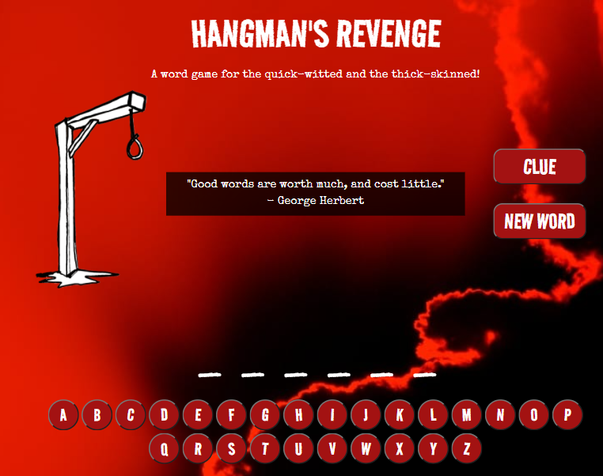

# HANGMAN'S REVENGE

## PURPOSE
Who didn’t enjoy playing the age-old game, “Hangman,” as a kid? Hangman’s Revenge is a simple web-based application that provides users that same enjoyable experience without the chalk or pencil stains on the side of your hand. Utilizing APIs from GIPHY and Datamuse, this new version of the classic game presents users with randomly generated words and provides them with clues in the form of related GIFs. As users select letters to fill in the remaining blank spaces of each new word, they are subject to the scathing insults of our vengeful hangman! At each game’s end, users can view all of the words they have previously encountered to find out their meaning. Hangman’s Revenge is the new spin on an old favorite, keeping you entertained and forever expanding your vocabulary!

## USER STORY 
AS A learner...
I WANT a fun way to learn new words...
SO that I can expand my vocabulary...

## APPLICATION FEATURES 
- interactive design 
- clues in the form of GIFs from GIPHY
- button deactivation after selection 
- wrong answers resulting in a new piece of the Hangman and an insult to the user
- upon game completion, win or lose, a calculated score showing number or correct and wrong answers 
- word list from all previous game sessions saved with Client-side server
- click to view definitions of each previously played word

## BUILT WITH 
- HTML
- CSS
- Bulma 
- JavaScript
- JQuery
- Datamuse API
- GIPHY API

## FUTURE DEVELOPMENT
- User selected word categories 
- Added animation to ease transitions and increase user experience 
- Added time calculation to final score 
- Save scores to create a list of High Scores for users to reference
- Using Evil Insults API to generate randomly selected insults for users after a wrong letter choice

## WEBPAGE
Click [here](https://cyanidethejuggla.github.io/hangmans-revenge/) to play Hangman's Revenge!

## CONTRUBITIONS 
Made by Katelyn Bunker, Anna Dodd, Scott Howell and Tyler Schultz

